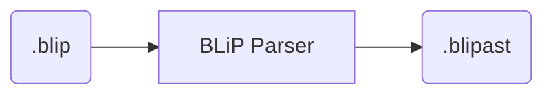
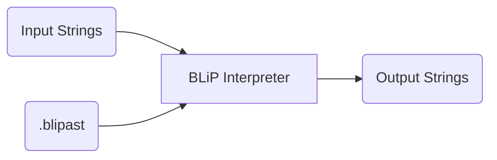
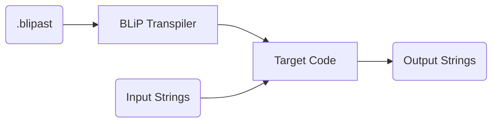

# BLiP

BLiP code is a Domain Specific Language (DSL) for parsing and manipulating string data.

Using the BLiP parser program, BLiP code can be parsed into a BLiP AST (Abstract Syntax Tree):

BLiP AST code can then either be directly run using a BLiP interpreter...

...or be transpiled into a target language of choice (such as Python)...

## Name history

The DSL is syntactically inspired by BNF (Backus-Naur Form) but is functionally different.
This is where BLiP originally derived its name: BNF Lite Parser.
Because the BLiP DSL grammar is functionally different from BNF, however, this acronym is a misnomer.
Therefore, officially, BLiP is a standalone name and is not an acronym.
