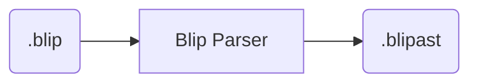
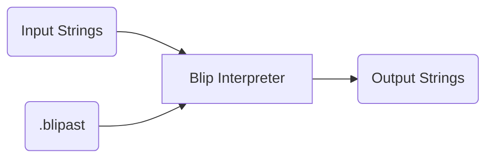
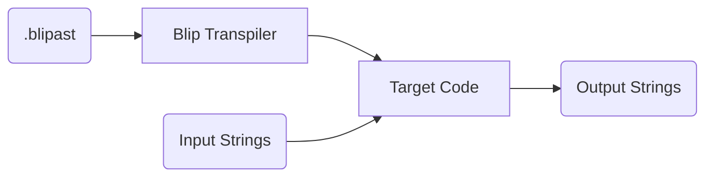

# Blip

Blip is a Domain Specific Language (DSL) for parsing and manipulating string data.

*Blip is currently under construction! Please be patient.*

## Design

Using the Blip parser, Blip code can be parsed into a Blip AST (Abstract Syntax Tree):

Blip AST code can then either be directly run using a Blip interpreter...

...or be transpiled into a target language of choice (such as Python)...

## For Developers

To run the unit tests:
1. Create a Python virtual environment and install `pytest`
2. From the root project directory, run `python -m pytest`

## Name history

Blip is syntactically inspired by BNF (Backus-Naur Form) but is functionally different.
This is where Blip originally derived its name: **B**NF **Li**te **P**arser.
Because Blip behaves differently from BNF, however, this acronym is a misnomer.
Therefore, officially, Blip is a standalone name and is not an acronym.
