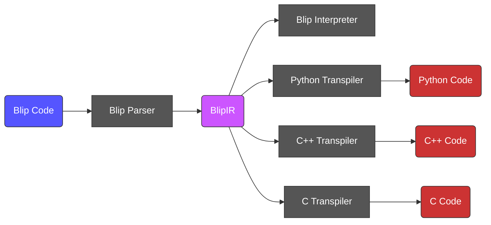

# Blip

Blip is a Domain Specific Language (DSL) for parsing and manipulating string data.
It can be directly interpreted or transpiled into various other languages.

It's intended to be easy to write, easy to understand, and intuitive.

```mermaid
flowchart LR
    blip(Blip Code)
    blipir(BlipIR)
    parser[Blip Parser]
    
    blip --> parser
    parser --> blipir
    style blip fill:#55f,color:#fff,stroke:#333
    style blipir fill:#c5f,color:#fff,stroke:#333
    style parser fill:#555,color:#fff,stroke:#333

    interpreter[Blip Interpreter]
    blipir --> interpreter
    style interpreter fill:#555,color:#fff,stroke:#333

    py(Python Code)
    py_transpiler[Python Transpiler]
    blipir --> py_transpiler --> py
    style py_transpiler fill:#555,color:#fff,stroke:#333
    style py fill:#c33,color:#fff,stroke:#333

    cpp(C++ Code)
    cpp_transpiler[C++ Transpiler]
    blipir --> cpp_transpiler --> cpp
    style cpp_transpiler fill:#555,color:#fff,stroke:#333
    style cpp fill:#c33,color:#fff,stroke:#333

    c(C Code)
    c_transpiler[C Transpiler]
    blipir --> c_transpiler --> c
    style c_transpiler fill:#555,color:#fff,stroke:#333
    style c fill:#c33,color:#fff,stroke:#333
```

:construction: *Blip is a work-in-progress project. See the [to-do list](docs/todo.md) for current progress!*

## Documentation

All Blip documentation can be found [in the `docs/` folder](docs/README.md).

If you're just getting started, the [Reference Programs](docs/refs/README.md) documentation is a good place to start. It contains example Blip programs plus each program's expected output when executed.
The Reference Programs documentation also functions as the core Blip test suite - all examples are parsed and executed by the unit tests, so the documentation is always up-to-date and accurate!

Blip also has a [to-do list](docs/todo.md) which shows a summary of what has been implemented so far, and what still needs doing.

## Nomenclature & Etymology

Blip is both the name of the language and the name of the CLI tool (similar to Python!).
To avoid this potential confusion, "Blip" refers to the language, and `blip` refers to the CLI tool.

Blip was originally inspired by BNF (Backus-Naur Form).
This is where Blip originally derived its name: **B**NF **Li**te **P**arser.
However, because Blip is functionally and syntactically different from BNF, this acronym was abandoned.
Blip is now a standalone name.

## Special Thanks

Thanks to [Dmitry Soshnikov](https://www.youtube.com/c/DmitrySoshnikov-education) for his YouTube videos on parsing!
