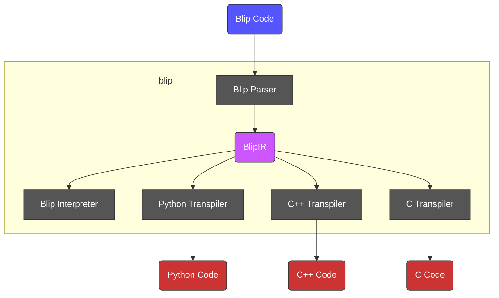

# Blip

[](https://opensource.org/licenses/MIT)
[](https://github.com/psysrc/blip/actions?query=branch%3Amain)

Blip is a Domain Specific Language (DSL) for parsing and manipulating string data.
It can be directly interpreted or transpiled into various other languages.

It's intended to be easy to write, easy to understand, and intuitive.

:construction: *Blip is a work-in-progress project. See the [to-do list](docs/todo.md) for current progress!*


```mermaid
flowchart TB
    blipcode(Blip Code)
    style blipcode fill:#55f,color:#fff,stroke:#333

    subgraph blip ["<div style="width:20em; height:3em; display:flex; justify-content: flex-start; align-items:flex-end;">blip</div>"]

        blipir(BlipIR)
        parser[Blip Parser]
        interpreter[Blip Interpreter]
        py_transpiler[Python Transpiler]
        cpp_transpiler[C++ Transpiler]
        c_transpiler[C Transpiler]

        style parser fill:#555,color:#fff,stroke:#333
        style interpreter fill:#555,color:#fff,stroke:#333
        style py_transpiler fill:#555,color:#fff,stroke:#333
        style cpp_transpiler fill:#555,color:#fff,stroke:#333
        style c_transpiler fill:#555,color:#fff,stroke:#333

        style blipir fill:#c5f,color:#fff,stroke:#333
        style py fill:#c33,color:#fff,stroke:#333
        style cpp fill:#c33,color:#fff,stroke:#333
        style c fill:#c33,color:#fff,stroke:#333
        
    end

    blipcode --> parser
    parser --> blipir

    py(Python Code)
    cpp(C++ Code)
    c(C Code)

    blipir --> interpreter
    blipir --> py_transpiler --> py
    blipir --> cpp_transpiler --> cpp
    blipir --> c_transpiler --> c
```

## Example

```blip
// Example Blip program for parsing an email

email = input[0]  // Get first string from the input list
email -> username "@" *  // Decompose email to extract the username
username -> first "." last  // Decompose username to get first and last name
ret first " " last  // Concatenate first and last name with a space
```

This code turns `joe.bloggs@hotmail.co.uk` into `joe bloggs`.

## Quick Start Guide

Blip code `hello_world.blip`:

```blip
ret "Hello World!"  // Return a hard-coded string
```

Execute directly with the Blip interpreter `./blip hello_world.blip`:

```json
["Hello World!"]
```

Transpile into Python `./blip -t python hello_world.blip`:

```python
def blip_autogenerated_function(input_strs: list[str]) -> list[str]:
    return ["Hello World!"]
```

Blip programs take a list of strings as input and output another list of strings.
This makes them easily transpilable into a function in another languages like the Python example above,
which can then be copied into other codebases and tweaked as necessary.

To create a self-contained runnable program in the target language, use the `--prog` flag when transpiling.
This will add code to manage reading the input strings from the command line and printing the output strings to stdout.
For example, `./blip -t python --prog hello_world.blip`:

```python
import argparse
import sys
import json


def blip_autogenerated_function(input_strs: list[str]) -> list[str]:
    return ["Hello World!"]


def main():
    argument_parser = argparse.ArgumentParser()
    argument_parser.add_argument("input_strings", nargs="*", help="Input strings")

    args = argument_parser.parse_args()

    try:
        input_strings: list[str] = args.input_strings
        output_strings: list[str] = blip_autogenerated_function(input_strings)
        print(json.dumps(output_strings))
        sys.exit(0)

    except Exception as err:
        print(f"Error: {err}", file=sys.stderr)
        sys.exit(1)


if __name__ == "__main__":
    main()
```

## Documentation

All Blip documentation can be found [in the `docs/` folder](docs/README.md).

If you're just getting started, the [Reference Programs](docs/refs/README.md) documentation is a good place to start. It contains example Blip programs plus each program's expected output when executed.
The Reference Programs documentation also functions as the core Blip test suite - all examples are parsed and executed by the unit tests, so the documentation is always up-to-date and accurate!

Blip also has a [to-do list](docs/todo.md) which shows a summary of what has been implemented so far, and what still needs doing.

## Nomenclature & Etymology

Blip is both the name of the language and the name of the CLI tool (similar to Python!).
To avoid this potential confusion, "Blip" refers to the language, and `blip` refers to the CLI tool.

Blip was originally inspired by BNF (Backus-Naur Form).
This is where Blip originally derived its name: **B**NF **Li**te **P**arser.
However, because Blip is functionally and syntactically different from BNF, this acronym was abandoned.
Blip is now a standalone name.

## Special Thanks

Thanks to [Dmitry Soshnikov](https://www.youtube.com/c/DmitrySoshnikov-education) for his YouTube videos on parsing!
