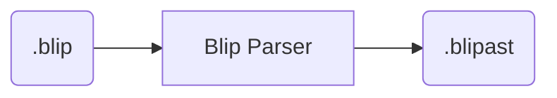
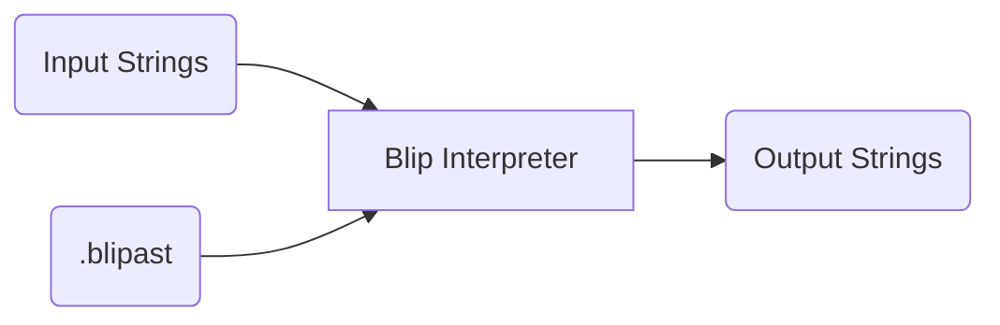
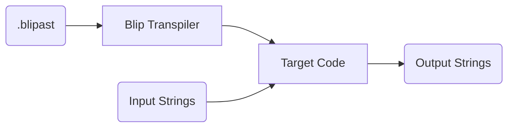

# Design documentation

Using the Blip parser, Blip code can be parsed into a Blip AST (Abstract Syntax Tree):

Blip AST code can then either be directly run using a Blip interpreter...

...or be transpiled into a target language of choice (such as Python)...

