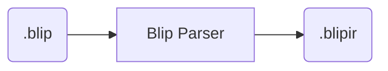
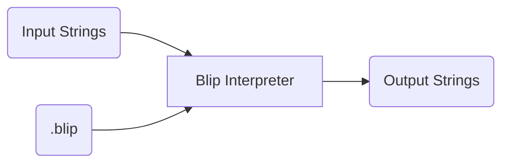
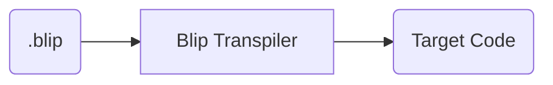

# Design documentation

Blip code can be used in a few different ways:

1. Directly execute Blip code using an interpreter
2. Transpile Blip code into a target language, like Python or C

## Intermediate representation - BlipIR

Blip code is parsed into an intermediate representation (IR) that is more convenient for computers to handle.
This is dubbed BlipIR and takes the file extension `.blipir`.

Using the Blip parser, Blip code (`.blip`) can be parsed into BlipIR (`.blipir`):

BlipIR (and hence the parser) is used for both transpiling and direct interpretation.
Therefore it is a very important part of the Blip processing lifecycle.

BlipIR code is an Abstract Syntax Tree (AST) encoded in JSON.

For convenience, the rest of this document omits BlipIR and the Blip parser from diagrams and descriptions.
Just remember that it remains a core part of the Blip interpretation and transpiling design.

## Directly execute Blip code using an interpreter

Using a Blip Interpreter, you can take Blip code and interpret it directly.

For example, this package provides a Blip Interpreter class written in Python.
Using this, you can give it raw Blip code and execute it straight from Python.

## Transpile Blip code into a target language

Using a Blip Transpiler, you can take Blip code and convert it into a target language.
For example, you could transpile into Python code, or C code, or any language the transpiler supports.

