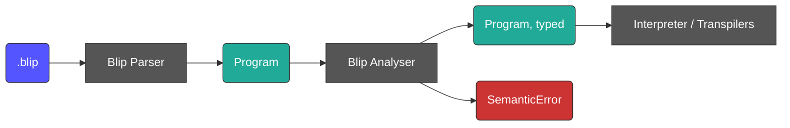

# Blip Static Analysis Design

This file documents how static analysis works in Blip.

Blip programs are fully type-inferred: there is no type syntax in the language. Every consumer of Blip IR (interpreter, transpilers)
nevertheless needs the type of every expression — the interpreter to validate operations, the transpilers to emit correctly typed target code.
Rather than have each one re-derive that knowledge individually, **Blip IR carries inferred types.** Every value node has a `blip_type` key,
so Blip IR is the parsed *and analysed* representation. The **Analyser** gives every expression and variable a concrete type,
reports input-independent semantic errors, and is a BlipIR-to-BlipIR transformation.

## Where it sits



| Package             | Contents                                                                              |
| ------------------- | ------------------------------------------------------------------------------------- |
| `bliplib/ir/`       | Node classes, `load` / `to_dict`, the ground type model and its compact-string codec  |
| `bliplib/analysis/` | The environment, unification, the `Var` type hole, and `SemanticError`                |

`bliplib/ir/` owns the program shape and `bliplib/analysis/` owns the type inference and semantics.

## The object model

`bliplib/ir/` defines a small class per node kind. The parser builds the node structure directly.

```
Program(statements, directives)

Statement = Assignment(target: Identifier, expression: Value)
          | Return(expression: Value)
          | Decomposition(target: Identifier, pattern: list[PatternElement])

Value     = StringLiteral(value) | IntegerLiteral(value) | BooleanLiteral(value)
          | Identifier(name)
          | Concatenation(operands: list[Value])
          | Index(target: Identifier, index: Value)
          | ListLiteral(elements: list[Value])

PatternElement = Identifier | StringLiteral | Wildcard

Directives(input: Directive | None, output: Directive | None)
Directive = FixedDirective(count, names) | RangeDirective(min, max)
```

Every `Value` carries a `blip_type` field; no other node does. `Wildcard`, the statements, the directives and `Program` itself have no type.

## Type annotations in BlipIR

`"type"` is taken by the node kind, so the type goes in `"blip_type"`, encoded as a compact string:

```
blip_type ::= "string" | "integer" | "boolean" | "list[" blip_type "]"
```

Nested lists are nameable — `"list[list[string]]"` because the type model is recursive. 

For `ret input[0]`:

```json
{
    "type": "program",
    "statements": [
        {
            "type": "return",
            "expression": {
                "type": "index",
                "blip_type": "string",
                "identifier": {
                    "type": "identifier",
                    "blip_type": "list[string]",
                    "name": "input"
                },
                "index": {
                    "type": "integer_literal",
                    "blip_type": "integer",
                    "value": 0
                }
            }
        }
    ]
}
```

Identifiers are annotated in binding positions too — an assignment target, a decomposition target, a decomposition pattern identifier — since
that is the variable's type, and a statically typed backend wants it in order to emit a declaration.

### Redundant `blip_type` annotations

A lot of `blip_type` annotations are redundant. Some node types such as `string_literal` can only ever have one valid `blip_type`,
but this redundancy is accepted to simplify the consumers of the data structure.

### Idempotent analysis

The analyser is a pure function of the *unannotated* Blip IR structure. It ignores any existing `blip_type` fields overwrites them, which makes
analysis idempotent.

### No derived variable map

The idea of a `"variables": {"fav_colour": "string"}` map on the `program` node was considered but rejected: it is strictly derived data,
reconstructible by a short walk over an annotated tree, and a cache inside a file format that can disagree with the tree next to it is not
worth the lines it saves.

## The type model

```
BlipType     = Scalar(STRING | INTEGER | BOOLEAN)       # bliplib/ir/
             | List[BlipType]

InferredType = Scalar | List[InferredType] | Var(id)    # bliplib/analysis/
```

`Var` is a type that has not yet been determined. It is not serialisable, and lives only in `bliplib/analysis/`.
If `Var` holes still exist in a program after the analyser has finished its mass, the program is considered ill-formed. 

If analysis of a program succeeds, two invariants hold:

1. Every `Value` node has a `blip_type` that is not `None`.
2. No `blip_type` contains unresolved `Var` holes.

## Type inference by unification

Some expressions do not determine their own type. The empty list literal `[]` is "a list of *something*": `List(?1)`, where `?1` is a **type
variable** — a hole in a type, represented by `Var`.

Holes are filled by constraints collected from how the program *uses* the value. `ret things` requires `things` to be `STRING` or
`List(STRING)`; if `things` is `List(?1)`, the shape already rules out `STRING`, so `?1` must be `STRING`.

**Unification** solves these constraints (which is part of the analyser). It takes two types and determines what the holes must
be for the two to become identical, or reports that no such solution exists.

Three details matter to anyone working on the analyser:

- **Recursive check.** Before filling a hole, verify the type being assigned does not contain that same hole. `?1 = List(?1)` denotes an
  infinite type, and without the check the substitution turns cyclic and resolution never ends.
- **Hole chains.** Unifying two holes binds one to the other, so resolving a type means following the chain to its end.
- **A final resolution pass.** Once the walk is complete, everything inferred is turned into a grounded type and written to its node. A `Var`
  still unbound is a `SemanticError` — the program is ill-formed.

### Type inference rules

| Node                                                     | Rule                                                                |
| -------------------------------------------------------- | ------------------------------------------------------------------- |
| `string_literal` / `integer_literal` / `boolean_literal` | `STRING` / `INTEGER` / `BOOLEAN`                                    |
| `list`                                                   | `List(T)` where all elements unify to `T`; `[]` is `List(Var)`      |
| `identifier`                                             | looked up in the environment; unbound is an error                   |
| `concatenation`                                          | every operand unifies with `STRING`; result `STRING`                |
| `index`                                                  | target `List(T)`, index unifies with `INTEGER`; result `T`          |
| `assignment`                                             | binds the name to the expression's type                             |
| `decomposition`                                          | target must be `STRING`; binds every pattern identifier as `STRING` |
| `return`                                                 | expression must be `STRING` or `List(STRING)`                       |
| built-in `input`                                         | `List(STRING)`                                                      |
| `!in username email`                                     | binds each name as `STRING`                                         |

The `return` rule is a *disjunction*, which unification does not handle natively. It is resolved by shape first: a `List` unifies its element
with `STRING`, a scalar unifies with `STRING`, and a bare unresolved `Var` is genuinely ambiguous and is an error.

Lists are **homogeneous** — `["a", 1]` is a `SemanticError`. Nested lists are permitted by the type model,
just remember that `ret` still accepts only `STRING` and `List(STRING)`.

## Scope and binding

**Variables are monomorphic: a name has one type for its entire lifetime within a scope.** Reassignment to a different type is a
`SemanticError`.

This is what makes the planned transpiler backends tractable. C and C++, for example, are both statically typed. If a Blip variable could
change type, every C variable would need a tagged union plus a discriminant check at every use. The monomorphic rule is the difference between
a backend that emits `char *name;` and one that emits a whole runtime type system. It also keeps the analyser a single forward pass with no fixpoint
iteration over loop bodies.

`input` is **reserved**. It is always bound to `List(STRING)`, and rebinding it — by assignment, by decomposition, or by naming it in an input
directive — is a `SemanticError`.

## Static versus runtime errors

The boundary is:

> **Static:** input-independent errors.
> **Runtime:** input-dependent errors.

Examples:

| Error                                             | Phase   |
| ------------------------------------------------- | ------- |
| Type mismatch                                     | Static  |
| Unbound identifier                                | Static  |
| Non-string decomposition target                   | Static  |
| Reassignment that changes a variable's type       | Static  |
| Heterogeneous list literal                        | Static  |
| Ambiguous decomposition pattern                   | Static  |
| Empty list whose element type is never determined | Static  |
| Decomposition pattern failure                     | Runtime |
| Index out of bounds                               | Runtime |
| Input / output directive arity                    | Runtime |
| Program halted without returning a value          | Runtime |

## Blip CLI

Analysis is required before a program can be interpreter or transpiled. Therefore, analysis runs in almost every mode, with one exception.
The `--no-analysis` flag can be used to suppress the analysis stage when used with the `--ir` flag.

## Reference programs that fail to compile

A program that raises `ParserError` or `SemanticError` produces no BlipIR and cannot be executed. Such a program is written with a
`#### Compilation` section in place of the `#### Blip IR` and `#### Execution` sections:

````markdown
## Reassignment Type Change

Variables are monomorphic, so a name cannot change type.

#### Blip code

```blip
x = "a"
x = 1
```

#### Compilation

```text
SemanticError
```
````

The absence of a `#### Compilation` section means the program is expected to compile.
