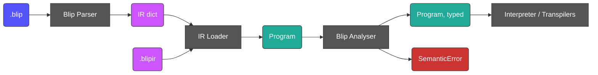

# Blip Static Analysis Design

This file documents the plan for adding static analysis to Blip.
Once the functionality here is fully implemented, this file should be updated to read in present-tense.

Blip programs are fully type-inferred: there is no type syntax in the language, and there is no plan to add any.
Every consumer of BlipIR nevertheless needs to know the type of every expression — the interpreter to validate operations, and the
transpilers to emit correctly typed target code. Today each consumer re-derives that knowledge, inconsistently: the interpreter re-checks
types dynamically at every operation, and the Python transpiler keeps a crude static approximation with an `UnknownType` escape hatch that
reaches code generation and produces silently wrong output.

This document describes two changes that together fix that:

1. **BlipIR carries types.** Every value node gains a `blip_type` key. BlipIR becomes the parsed *and analysed* representation, and the
   **Analyser** — a new pass that assigns a concrete type to every expression and variable, and reports input-independent semantic errors —
   is a BlipIR-to-BlipIR transformation.
2. **BlipIR is loaded into objects.** A new object model gives every consumer a validated tree of typed nodes to walk, instead of a raw
   `dict` to destructure defensively.

## Where it sits



Two new packages:

| Package             | Contents                                                                                        |
| ------------------- | ----------------------------------------------------------------------------------------------- |
| `bliplib/ir/`       | Node classes, `load` / `to_dict`, the ground type model and its compact-string codec            |
| `bliplib/analysis/` | The environment, unification, the `Var` type hole, and `SemanticError`                          |

`bliplib/ir/` owns the JSON shape — it is the only module that knows what `{"type": "index"}` looks like on disk. `bliplib/analysis/` owns
inference. The split is load-bearing in one specific way: the type *hole* used during inference lives in `analysis/`, and the serialisation
codec lives in `ir/`, so "no unresolved hole can reach a serialised IR" is a structural fact rather than a convention — there is nowhere for
`format_type(Var)` to be defined.

## Why types belong in BlipIR

An earlier revision of this document had the analyser emit a *mirror tree*: a parallel typed structure, leaving BlipIR untyped. That was
wrong, for three reasons.

- **`.blipir` is a file format.** [The ecosystem design](design_ecosystem.md) gives BlipIR its own file extension. Under the mirror-tree
  design, a `.blipir` file is a half-compiled artifact that every consumer must re-analyse, which means every consumer needs the analyser,
  and the format's self-description stops at syntax. A C transpiler handed a typed `.blipir` needs no inference at all.
- **Optimisations want IR-to-IR.** `docs/todo.md` lists optimisations as a feature to be designed. Passes compose when they share one shape.
  With a mirror tree, a future pass either runs before analysis without type information, or operates on a second representation that has to
  be maintained in step. Annotated BlipIR makes the analyser the first of a pipeline, not a fork in it.
- **The cost was overstated.** Annotating every value node across all 15 reference programs adds 53 lines to the 489 in the `#### Blip IR`
  blocks — roughly 11%. The IR is already one key per line and the blocks live inside collapsed `<details>` elements, so a type key per
  value node disappears into the noise. Removing the `expression` wrapper in the same work takes 78 lines back out, so the annotated IR is
  about 5% *shorter* than today's.

The mirror tree's genuine benefit was that backends could not be handed a node with a missing field. That benefit does not require a second
tree — it requires a loader, which is the next section.

## The object model

`bliplib/ir/` defines a small class per node kind. Consumers call `load()` once and walk objects thereafter; no backend destructures a
`dict`.

```
Program(statements, directives)

Statement = Assignment(target: Identifier, expression: Value)
          | Return(expression: Value)
          | Decomposition(target: Identifier, pattern: list[PatternElement])

Value     = StringLiteral(value) | IntegerLiteral(value) | BooleanLiteral(value)
          | Identifier(name)
          | Concatenation(operands: list[Value])
          | Index(target: Identifier, index: Value)
          | ListLiteral(elements: list[Value])

PatternElement = Identifier | StringLiteral | Wildcard

Directives(input: Directive | None, output: Directive | None)
Directive = Fixed(count, names) | Range(min, max)
```

Every `Value` carries a `blip_type` field; no other node does. `Wildcard`, the statements, the directives and `Program` itself have no type.

Three properties matter:

- **`load()` validates totally.** An unknown node kind, a missing field, an unrecognised type string, or an annotation that contradicts the
  node it sits on raises `IRError`, a new subclass of `BlipError`. This is neither a `ParserError` (nothing was parsed) nor a `SemanticError`
  (nothing was analysed) — a malformed `.blipir` is its own failure mode, and it is the failure mode that lets every backend delete its
  defensive `case _: raise` fallbacks. The contradiction check is described under [Annotating what is derivable](#annotating-what-is-derivable).
- **Nodes are mutable.** `blip_type` starts as `None` and the analyser fills it in place. Unification's final resolution pass — walk the
  tree and replace every hole with what it resolved to — is natural on a mutable tree and awkward on a frozen one. These are data carriers
  that backends read, so their fields are public: a deliberate departure from the `self.__private` convention used elsewhere.
- **The round trip is exact.** `load(d).to_dict() == d` for any well-formed `d`. This is already tested for the whole corpus at no cost,
  because the reference-program test compares `blip --ir` output against the fixture for exact equality.

### The `expression` wrapper is removed

BlipIR used to wrap some values in `{"type": "expression", "value": ...}`. It is deleted from the format outright — not collapsed in the object
model and re-inserted on the way out — so every value slot holds a value node directly.

The wrapper was not merely uninformative; it was *asymmetrically* uninformative, and that is what condemned it. Only the parser's
`__parse_expression` ever produced one, so the wrapper marked "this slot was filled by the general expression production" — a fact about the
parser's call graph, not about the program. It appeared in `assignment.expression`, `return.expression` and `list.elements[*]`, and not in
`concatenation.operands[*]`, `decomposition.pattern[*]` or `index.index`, which are filled by narrower parser helpers. It did not even work as
a reliable grammar marker, since the narrow slots accept kinds that also appear wrapped elsewhere: `index.index` takes an `integer_literal` or
an `identifier`, both of which are wrapped in the slots above.

A uniformly applied but useless convention would have been tolerable. Present in three value slots out of six, it invited every reader to infer
that the wrapped slots differ semantically from the unwrapped ones. They do not.

Removing it is a change to the file format, which is cheap now and never cheaper later: `blip` does not read `.blipir` as input yet, so nothing
outside this repository consumes the shape. It also deletes a whole class of work — there is no per-slot re-wrapping table for `to_dict()` to
encode, and no re-insertion fidelity risk to guard. [Stage 0.5](#implementation-stages) does it on its own, before any analysis work starts.

### The parser emits a `dict` for now

`bliplib/parser/` keeps producing a `dict` rather than objects, and `load()` runs immediately afterwards. Rewriting the parser to build objects
directly — making `to_dict()` the only code that knows the JSON shape — is a worthwhile cleanup with no user-visible effect, so it is deferred
rather than bundled in. Until then, an unannotated IR `dict` exists briefly between the parser and the loader, and is never serialised except
by `--no-analysis`. That `dict` is structurally identical to the serialised form and differs from it only by the absence of annotations, because
Stage 0.5 removes the `expression` wrapper from the parser itself rather than hiding it behind the loader.

## Type annotations in BlipIR

`"type"` is taken by the node kind, so the type goes in `"blip_type"`, encoded as a compact string:

```
blip_type ::= "string" | "integer" | "boolean" | "list[" blip_type "]"
```

Nested lists are nameable — `"list[list[string]]"` — because the type model is recursive. The alternative, a nested object such as
`{"kind": "list", "element": {"kind": "string"}}`, is more self-describing JSON but costs five lines per annotation at `indent=4` instead of
one. The compact form needs a short reader, and it reads the way this documentation already talks about types.

For `ret input[0]`:

```json
{
    "type": "program",
    "statements": [
        {
            "type": "return",
            "expression": {
                "type": "index",
                "blip_type": "string",
                "identifier": {
                    "type": "identifier",
                    "blip_type": "list[string]",
                    "name": "input"
                },
                "index": {
                    "type": "integer_literal",
                    "blip_type": "integer",
                    "value": 0
                }
            }
        }
    ]
}
```

Identifiers are annotated in binding positions too — an assignment target, a decomposition target, a decomposition pattern identifier — since
that is the variable's type, and a statically typed backend wants it in order to emit a declaration.

### Annotating what is derivable

Most of these annotations are redundant. Of the seven value kinds, only two can carry type information that the structure does not already pin
down — an `identifier` always, and a `list` when it is empty:

| Node                                                     | Derivable from structure alone?                            |
| -------------------------------------------------------- | ---------------------------------------------------------- |
| `string_literal` / `integer_literal` / `boolean_literal` | yes — fixed by the node kind                                |
| `concatenation`                                          | yes — always `STRING`                                       |
| `list`, non-empty                                        | yes — from the elements' own annotations                     |
| `list`, empty                                            | **no** — only inference determines the element type          |
| `index`                                                  | yes — strip one `list[…]` from the target's annotation       |
| `identifier`                                             | **no** — the type comes from the environment                 |

`index` only appears in the first column because identifiers are annotated; it is derivable *given* annotation, not instead of it.

Every value node is annotated anyway, and the reason is not information content — it is that **the rule a reader would have to know costs more
than the lines it saves.** Under a partial scheme, "what is this node's type?" stops being a key lookup and becomes a seven-case function that
every consumer needs and that all consumers must implement identically — a smaller instance of the problem this document opens with. It would
also mean a `.blipir` can only be read by something that already knows Blip's typing rules, which is the self-description argument made against
the mirror tree, one level down: a formatter, a linter, an ad-hoc `jq` query and a prototype backend all get the answer for free, where
otherwise each would embed "concatenation is always a string". This is the same trade LLVM makes by writing `i32` on operands that could be
inferred — an IR is read far more often than it is written.

Invariant 1 below is the other reason. "Every `Value` node has a `blip_type` that is not `None`" is checkable mechanically over the whole
corpus; its partial-scheme equivalent cannot even be stated without the table above.

The redundancy does create a failure mode that a minimal scheme would not have: `{"type": "integer_literal", "blip_type": "string"}` is a file
that contradicts *itself*, so something has to decide whether the kind or the annotation wins. **`load()` decides by rejecting the file.** It
re-derives every annotation in the first column — bottom-up, since each rule needs only the node and its children, both of which the loader
has — and raises `IRError` on any disagreement. This is what makes the redundancy a checksum rather than a liability, and it means a backend
that consumes an annotated `.blipir` without running the analyser still has every derivable annotation verified for free.

An *absent* annotation is not an error at load time: the loader must accept the parser's unannotated `dict`, and `--no-analysis` emits one. The
check applies to whatever annotations are present. Requiring them to be present at all is the analyser's job, via the invariants below.

### Annotations are output, never input

The analyser is a pure function of the *unannotated* structure. It ignores any `blip_type` already present and overwrites it, which makes
analysis idempotent and keeps the analyser from growing a second "trusting" mode.

This creates one exposure, stated here so that it is a decision rather than an oversight: **a serialised type can lie.** A hand-edited or
tool-generated `.blipir` can carry annotations that its structure does not support, and a backend that consumes the file without re-analysing
it will believe them. The position taken is that the annotations are authoritative and garbage in is garbage out — the same bargain Java
bytecode and LLVM IR make, minus the verifier. `blip --check` is the verifier: it re-derives every type and reports any disagreement with the
annotations already in the file.

The loader's consistency check narrows the exposure but does not close it. What survives is a lie that is *internally consistent* and anchored
on an `identifier` or an empty `list` — annotating a variable as `integer` at every one of its occurrences, say, when its binding gives it
`STRING`. Those are precisely the positions where the environment is the only source of truth, so only a pass that rebuilds the environment can
catch them. That pass is `--check`.

### No derived variable map

A `"variables": {"fav_colour": "string"}` map on the `program` node was considered, since a C backend wants to declare variables up front. It
is rejected: it is strictly derived data, reconstructible by a short walk over an annotated tree, and a cache inside a file format that can
disagree with the tree next to it is not worth the lines it saves. The object model exposes it as a computed property instead.

## The type model

```
BlipType = Scalar(STRING | INTEGER | BOOLEAN)
         | List(element: BlipType)
         | Var(id)
         | Unknown
```

`List` is recursive, so nested lists are nameable. This is more honest than a flat type alias, which cannot express what the interpreter can
already build at runtime.

`Unknown` is **strictly an error-recovery value**. It exists so that one bad expression does not cascade into twenty errors. `Var` is a type
not yet determined — see the next section. Neither is serialisable; both live only in `bliplib/analysis/`.

Three invariants hold if, and only if, analysis succeeds:

1. Every `Value` node has a `blip_type` that is not `None`.
2. No `blip_type` is `Unknown` or contains an unresolved `Var`.
3. Every `blip_type` is therefore expressible as a compact string.

Backends may assert on all three. This is the precise difference from the Python transpiler's current `UnknownType`, which reaches codegen
and produces silently wrong output.

## Type inference by unification

Some expressions do not determine their own type. The empty list literal `[]` is "a list of *something*": `List(?1)`, where `?1` is a
**type variable** — a hole in a type, represented by `Var`.

Holes are filled by constraints collected from how the program *uses* the value. `ret things` requires `things` to be `STRING` or
`List(STRING)`; if `things` is `List(?1)`, the shape already rules out `STRING`, so `?1` must be `STRING`.

**Unification** is the algorithm that solves these constraints. It takes two types and determines what the holes must be for the two to
become identical, or reports that no such solution exists:

- a hole against anything — fill the hole (this is the only place where anything is learned);
- two `List`s — recurse into their element types;
- two identical scalars — nothing to do;
- anything else — `SemanticError`. This is the only place type errors are raised.

Three details matter to anyone working on the analyser:

- **The occurs check.** Before filling a hole, verify the type being assigned does not contain that same hole. `?1 = List(?1)` denotes an
  infinite type, and without the check the analyser builds a cyclic structure and hangs. Close to unreachable in Blip today, but it is three
  lines of insurance against a non-terminating compiler.
- **Holes chain.** Unifying two holes binds one to the other, so resolving a type means following the chain to its end. This is a
  stripped-down union-find; at Blip's scale the naive loop is fine.
- **A final resolution pass.** Once the walk is complete, the tree is walked again and every `Var` replaced by the type it resolved to. Any
  `Var` still unbound is a `SemanticError` — the program never said what it wanted. This pass is also what establishes invariant 3 above, and
  therefore what makes the tree serialisable.

Unification and reassignment are **different operations, and the code must keep them distinct**. Unification *refines* a hole; reassignment
*compares* two fully-formed types and rejects a mismatch (see Scope and binding, below). `x = []` followed by a use at `STRING` is
inference. `x = "a"` followed by `x = 1` is an error.

Because Blip variables are monomorphic and Blip has no functions yet, unification is *all* that is required — there is no generalisation and no
instantiation, which is the difference between this and a full Hindley–Milner implementation. See Deferred decisions.

### Inference rules

| Node                                                     | Rule                                                                  |
| -------------------------------------------------------- | --------------------------------------------------------------------- |
| `string_literal` / `integer_literal` / `boolean_literal` | `STRING` / `INTEGER` / `BOOLEAN`                                      |
| `list`                                                   | `List(T)` where all elements unify to `T`; `[]` is `List(Var)`        |
| `identifier`                                             | looked up in the environment; unbound is an error                     |
| `concatenation`                                          | every operand unifies with `STRING`; result `STRING`                  |
| `index`                                                  | target `List(T)`, index unifies with `INTEGER`; result `T`            |
| `assignment`                                             | binds the name to the expression's type                               |
| `decomposition`                                          | target must be `STRING`; binds every pattern identifier as `STRING`   |
| `return`                                                 | expression must be `STRING` or `List(STRING)`                         |
| built-in `input`                                         | `List(STRING)`                                                        |
| `!in username email`                                     | binds each name as `STRING`                                           |

The `return` rule is a *disjunction*, which unification does not handle natively. It is resolved by shape first: a `List` unifies its
element with `STRING`, a scalar unifies with `STRING`, and a bare unresolved `Var` is genuinely ambiguous and is an error.

Lists are **homogeneous** — `["a", 1]` is a `SemanticError`. Nested lists are permitted by the type model, though `ret` accepts only
`STRING` and `List(STRING)`, so a nested list cannot currently be returned.

## Scope and binding

**Variables are monomorphic: a name has one type for its entire lifetime within a scope.** Reassignment to a different type is a
`SemanticError`.

This is not merely analyser convenience — it is what makes the planned backends tractable. C is statically typed. If a Blip variable could
change type, every C variable would need a tagged union plus a discriminant check at every use. The monomorphic rule is the difference
between a backend that emits `char *name;` and one that emits a runtime type system. It also keeps the analyser a single forward pass with
no fixpoint iteration over loop bodies.

`input` is **reserved**. It is always bound to `List(STRING)`, and rebinding it — by assignment, by decomposition, or by naming it in an
input directive — is a `SemanticError`.

The following constructs are described in the [Language Reference](language_reference.md) but are not yet implemented by the parser. Their
binding rules are settled here so that the analyser does not have to be redesigned when they land:

- **`if` / `else` branches.** A variable bound in only one branch is **not** bound after the `if`. A variable bound in all branches must
  have the same type in each.
- **Conditional decomposition** (`if email -> name "@" domain { ... }`). Bindings are visible **inside the block only**, since they do not
  exist when the decomposition fails.
- **Decomposition alternatives** (`a | b`). All alternatives must bind the same names at the same types. This rules out a nasty class of bug
  where the set of bound variables depends on which alternative matched.
- **Loops.** The body is analysed once. A variable assigned in the body must keep the type it had before the loop.
- **Loop variables.** `for item in items` binds `item` to the element type of `items`; `for num in 3` binds `num` to `INTEGER`. The loop
  variable is scoped to the body.

## Static versus runtime errors

The boundary is:

> **Static:** input-independent errors of *type or binding*.
> **Runtime:** everything input-dependent, plus everything outside the type-and-binding remit.

The second half of that definition is load-bearing. "Input-independent" alone would drag in reachability analysis, arity arithmetic and
constant folding — the `docs/todo.md` "Definite-return analysis, static directive arity checks" item is a separate pass, and the two should
not be conflated.

| Error                                             | Phase   |
| ------------------------------------------------- | ------- |
| Type mismatch                                     | Static  |
| Unbound identifier                                | Static  |
| Non-string decomposition target                   | Static  |
| Reassignment that changes a variable's type       | Static  |
| Heterogeneous list literal                        | Static  |
| Empty list whose element type is never determined | Static  |
| Decomposition pattern failure                     | Runtime |
| Index out of bounds                               | Runtime |
| Input / output directive arity                    | Runtime |
| Program halted without returning a value          | Runtime |

### Deliberate non-checks

Four things the analyser could plausibly check, and does not:

- **A program with no `ret`.** Input-independent, but it is a reachability question rather than a type-and-binding one, and it gets harder
  the moment `if` and `while` land. The "Empty Program" reference program documents this as a valid program that fails at execution, and
  that stays true. Definite-return analysis is a separate feature for another day.
- **Directive arity against a literal return.** `!out 2` with `ret "OK"` is provably wrong without running the program, but proving it needs
  *length* tracking, which is not in the type model. It would also be inconsistent: provable for a literal, unknowable for `ret input`.
  Arity stays a runtime check, so both "Error case" directive reference programs are unaffected.
- **Constant index bounds.** `input[0]` is well-typed; whether the input has an element 0 is input-dependent.
- **Indexing with an identifier.** `input[i]` is well-typed when `i` is `INTEGER`. The interpreter currently rejects it at runtime as
  unimplemented, but that is an implementation gap, not a semantic one, and static analysis is the wrong place to express "not built yet".

## CLI surface

Analysis runs in **every** mode, so a static error surfaces identically whether interpreting, transpiling or dumping IR. `--ir` output is
always fully analysed.

| Flag            | Behaviour                                                                                          |
| --------------- | -------------------------------------------------------------------------------------------------- |
| `--check`       | Parse, load and analyse; emit nothing on success. Also re-verifies annotations already present      |
| `--no-analysis` | Dump the unannotated IR. For debugging the analyser itself; not a supported interchange format      |

`--check` is the verifier that the "annotations are authoritative" bargain above depends on. It is also the cheapest possible pre-commit
hook for a repository of Blip programs.

Reading a `.blipir` file as CLI input is **not** part of this work — `blip` accepts `.blip` source only today, and detecting the format is a
separate decision. The annotation design is what makes that feature worth having later, and `load()` is the code it will need.

## Reference programs that fail to compile

A program that raises `ParserError` or `SemanticError` produces no BlipIR and therefore cannot be executed. Such a program is written with a
`#### Compilation` section in place of the `#### Blip IR` and `#### Execution` sections:

````markdown
## Reassignment Type Change

Variables are monomorphic, so a name cannot change type.

#### Blip code

```blip
x = "a"
x = 1
```

#### Compilation

```text
SemanticError
```
````

The absence of a `#### Compilation` section means the program is expected to compile, so all existing reference programs are unaffected.

Consequences for the test suite:

- `ReferenceProgram.blip_ir` becomes optional, and the class gains the expected compile error. The reference-program parser currently reaches
  the end of its token stream if a section is missing, so its section handling has to become conditional rather than sequential.
- The IR test asserts that `blip --ir` exits non-zero for these programs.
- The interpreter and transpiler tests assert the same non-zero exit, and run no executions.

Two existing tests also change meaning, because `--ir` output now includes types:

- `test/integration/program_references/test_parser.py` becomes a parse-*and*-analyse test. The file and its test function should be renamed
  to say so; `test_ir.py::test_reference_program_ir` reflects what it actually covers.
- `test/unit/program_references/test_parsing.py` compares the analysed tree's `to_dict()` against the fixture, for the same reason.

## Evidence from the existing corpus

Before committing to the monomorphic rule, all 15 reference programs were checked against the semantics described here — for reassignments
that change type, heterogeneous lists, nested lists, bad return types and unbound identifiers.

**All 15 are clean.** No existing program is rejected by any rule in this document, so none of these decisions is a behaviour change for
code that exists today.

## Implementation stages

Ordered so that nothing lands half-wired, and so that the riskiest mechanical change is proven before any semantics depend on it.

**Stage 0 — this document.** Plus `AGENTS.md`, which states that BlipIR "is an ordinary `dict` — there are no IR node classes" and tells
consumers to destructure with `match`/`case`. Both become false at Stage 1, so `AGENTS.md` is updated then, not now.

**Stage 0.5 — delete the `expression` wrapper.** No new packages, no analysis, no object model: just the removal of a node kind from the format
and from the parser that produces it and the two consumers that read it. `__parse_expression` returns its value instead of wrapping it; the
interpreter's `__interpret_expression` becomes an unwrap of nothing and its three call sites collapse onto `__interpret_expression_value`; the
Python transpiler loses the outer `case {"type": "expression"}` in `PythonExpression.from_blip_ir`. The 15 `#### Blip IR` fixtures lose three
lines per wrapper, 78 in total.

This is its own stage, before the loader, for two reasons. It keeps a format change out of a refactor — the existing execution and IR tests
already cover it end to end, with no new code in play to confuse a failure. And it restores Stage 1's most useful property: with the fixtures
already reshaped, the loader's output is byte-identical to them, so the round trip is proven without the fixtures moving underneath it.

The fixture edit is mechanical but is being made to the files that are the test oracle, so it is verified in the direction that does not beg the
question: re-wrapping the new fixtures must reproduce the old ones exactly, and the diff must consist only of removed `"type": "expression"` and
`"value": {` lines, removed closing braces, and dedents.

**Stage 1 — `bliplib/ir/`, no types.** Node classes, `load`, `to_dict`, `IRError`. Wire `--ir` to print `load(parse(src)).to_dict()`.
Output is byte-identical, so every existing test stays green — which is the point: the round trip is proven against the whole corpus before any
semantics exist. Because the wrapper is already gone, `to_dict()` has no per-slot special cases and every value slot serialises the same way.

**Stage 2 — the analyser, no consumers.** `bliplib/analysis/`: type model, environment, unification, occurs check, resolution pass, the
monomorphic rule, `SemanticError`. Validated against the corpus — no errors on any of the 15 valid programs, and for every row of every
`#### Execution` table, the statically inferred return type matches the shape of the recorded output. That is a real conformance check built
entirely from fixtures that already exist. Unit tests cover the error paths.

**Stage 3 — wire it in, annotate the fixtures.** Analysis runs in every mode. All 15 `#### Blip IR` blocks gain `blip_type` keys, 53 lines in
total. This is the first stage in which a file can carry an annotation, so the compact-string codec and the loader's annotation consistency
check land here, with unit tests for the contradictions they reject. Add
`--check` and `--no-analysis`, the `#### Compilation` reference-program category, the first static-error reference programs, and the test
renames described above. [The ecosystem design](design_ecosystem.md) describes BlipIR as the output of the parser and needs the analyser
adding to its pipeline diagram and its `--ir` description.

**Stage 4 — the Python transpiler consumes the typed tree.** Delete `UnknownType`. `PythonReturnStatement`'s list-wrapping decision becomes
a lookup rather than a guess. This is where the Variables, Concatenation, Decomposition and Indexing `xfail`s come off and the `docs/todo.md`
matrix cells move.

**Stage 5 — the interpreter consumes it.** Drop the `isinstance` checks that are now statically guaranteed, keeping the input-dependent
ones. Optional, and lowest priority; the interpreter works today.

Stages 0.5 to 4 deliver the value; 5 is cleanup.

## Risks

- **A serialised type can lie.** Discussed above. Narrowed to internally consistent lies on identifiers and empty lists by the loader's
  consistency check, and mitigated beyond that by `--check`, but not eliminated. This is acceptable.
- **Fixtures are the oracle for their own reshape.** Stage 0.5 edits the 15 `#### Blip IR` blocks that the tests compare against, so a mistake
  in the edit is a mistake in the oracle. Guarded by checking the reshape in the reverse direction and by constraining the shape of the diff,
  both described in that stage.
- **Two shapes in flight.** Until the parser builds objects directly, an unannotated IR `dict` exists between the parser and the loader. It
  is internal and short-lived, but it is a second shape that a reader has to know about. It differs from the serialised form only by the absence
  of annotations — Stage 0.5 removes the wrapper from the parser, not just from the output — and it goes away once the parser builds objects
  directly.
- **Scope creep into a general type checker.** The `docs/todo.md` analysis items are broader than this pass. Keep this one to types and
  binding.

## Deferred decisions

- **The parser building objects directly.** Would make `to_dict()` the only code that knows the JSON shape. No user-visible effect, so it is
  not bundled into this work.
- **`.blipir` as CLI input.** Discussed under CLI surface.
- **User-defined functions.** `docs/todo.md` lists functions as a feature still to be designed. Functions will likely be explicitly typed, but
  if Blip gets functions and they are meant to be generic, this is where unification's missing half — generalisation at the definition and
  instantiation at each use, the other half of Hindley–Milner — becomes necessary. That decision belongs with the functions design, not here;
  the unification described above is the part that would not change.
- **Source locations.** BlipIR carries none, so a semantic error can describe a conflict structurally but cannot point at a line. This bites
  hardest when two distant constraint sites disagree. Tracked under the `docs/todo.md` "Improved error messages" item.
- **Comparison operators and arithmetic.** `if` and `while` conditions must be `BOOLEAN`, but no operator produces one yet, and arithmetic
  is still to be designed. Rules will be added when the operators are.
- **Generalised decomposition targets.** The rule is stated above as "the target must be `STRING`"; the IR currently permits only an
  identifier, which is why `Decomposition.target` and `Index.target` are typed as `Identifier` in the object model. The alternative
  assignment syntax `"John" -> name` in the Language Reference implies a target that is an arbitrary `STRING`-typed expression, which is a
  parser change first.
