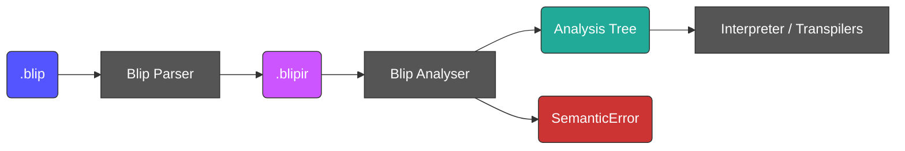

# Blip Static Analysis Design

Blip programs are fully type-inferred: there is no type syntax in the language, and there is no plan to add any.
Every consumer of BlipIR nevertheless needs to know the type of every expression — the interpreter to validate operations, and the
transpilers to emit correctly typed target code.

This document describes the **Analyser**: a single pass over BlipIR, after parsing, that assigns a concrete type to every expression and
variable, and reports input-independent semantic errors. Backends consume its output instead of inferring anything themselves.

## Where it sits



The analyser lives in `bliplib/analysis/` and raises `SemanticError`, a new subclass of `BlipError` alongside `ParserError`,
`InterpreterError` and `TranspilerError`. The phase is genuinely distinct from parsing, so it gets its own error class.

## The analysis tree

The analyser does not annotate BlipIR in place. It consumes the raw `dict` and produces a **parallel tree of typed node objects**, each
carrying its resolved type. Backends walk that tree and never touch the raw `dict` again.

This matters for three reasons:

- **BlipIR is unchanged.** Every `#### Blip IR` block in `docs/refs/*.md` is a hand-written fixture. Annotating the IR would churn all of
  them, and would bloat `--ir` output.
- **Validation happens once, at the boundary.** Backends receive nodes with guaranteed-present fields, and can drop their defensive
  `case _: raise` fallbacks.
- **It is what the C and C++ backends actually need** — a statically typed tree, rather than a dict they must re-interpret.

The cost is one tree definition to maintain alongside the IR. That is real, but it is the same information the backends are each partially
reconstructing today, and the analyser being the *only* thing that reads raw IR means an IR shape change breaks one module loudly rather
than four quietly.

## The type model

```
BlipType = Scalar(STRING | INTEGER | BOOLEAN)
         | List(element: BlipType)
         | Var(id)
         | Unknown
```

`List` is recursive, so nested lists are nameable. This is more honest than a flat type alias, which cannot express what the interpreter can
already build at runtime.

`Unknown` is **strictly an error-recovery value**. It exists so that one bad expression does not cascade into twenty errors. `Var` is a type
not yet determined — see the next section.

Two invariants hold if, and only if, analysis succeeds:

1. No node has type `Unknown`.
2. No node contains an unresolved `Var`.

Backends may assert on both. This is the precise difference from the Python transpiler's current `UnknownType`, which reaches codegen and
produces silently wrong output.

## Type inference by unification

Some expressions do not determine their own type. The empty list literal `[]` is "a list of *something*": `List(?1)`, where `?1` is a
**type variable** — a hole in a type, represented by `Var`.

Holes are filled by constraints collected from how the program *uses* the value. `ret things` requires `things` to be `STRING` or
`List(STRING)`; if `things` is `List(?1)`, the shape already rules out `STRING`, so `?1` must be `STRING`.

**Unification** is the algorithm that solves these constraints. It takes two types and determines what the holes must be for the two to
become identical, or reports that no such solution exists:

- a hole against anything — fill the hole (this is the only place where anything is learned);
- two `List`s — recurse into their element types;
- two identical scalars — nothing to do;
- anything else — `SemanticError`. This is the only place type errors are raised.

Three details matter to anyone working on the analyser:

- **The occurs check.** Before filling a hole, verify the type being assigned does not contain that same hole. `?1 = List(?1)` denotes an
  infinite type, and without the check the analyser builds a cyclic structure and hangs. Close to unreachable in Blip today, but it is three
  lines of insurance against a non-terminating compiler.
- **Holes chain.** Unifying two holes binds one to the other, so resolving a type means following the chain to its end. This is a
  stripped-down union-find; at Blip's scale the naive loop is fine.
- **A final resolution pass.** Once the walk is complete, the analysis tree is walked again and every `Var` replaced by the type it
  resolved to. Any `Var` still unbound is a `SemanticError` — the program never said what it wanted. The analysis tree being a separate
  structure handed over as its own step is what makes this pass natural to write.

Unification and reassignment are **different operations, and the code must keep them distinct**. Unification *refines* a hole; reassignment
*compares* two fully-formed types and rejects a mismatch (see Scope and binding, below). `x = []` followed by a use at `STRING` is
inference. `x = "a"` followed by `x = 1` is an error.

Because Blip variables are monomorphic and Blip has no functions, unification is *all* that is required — there is no generalisation and no
instantiation, which is the difference between this and a full Hindley–Milner implementation. See Deferred decisions.

### Inference rules

| Node                                                     | Rule                                                                  |
| -------------------------------------------------------- | --------------------------------------------------------------------- |
| `string_literal` / `integer_literal` / `boolean_literal` | `STRING` / `INTEGER` / `BOOLEAN`                                      |
| `list`                                                   | `List(T)` where all elements unify to `T`; `[]` is `List(Var)`        |
| `identifier`                                             | looked up in the environment; unbound is an error                     |
| `concatenation`                                          | every operand unifies with `STRING`; result `STRING`                  |
| `index`                                                  | target `List(T)`, index unifies with `INTEGER`; result `T`            |
| `assignment`                                             | binds the name to the expression's type                               |
| `decomposition`                                          | target must be `STRING`; binds every pattern identifier as `STRING`   |
| `return`                                                 | expression must be `STRING` or `List(STRING)`                         |
| built-in `input`                                         | `List(STRING)`                                                        |
| `!in username email`                                     | binds each name as `STRING`                                           |

The `return` rule is a *disjunction*, which unification does not handle natively. It is resolved by shape first: a `List` unifies its
element with `STRING`, a scalar unifies with `STRING`, and a bare unresolved `Var` is genuinely ambiguous and is an error.

Lists are **homogeneous** — `["a", 1]` is a `SemanticError`. Nested lists are permitted by the type model, though `ret` accepts only
`STRING` and `List(STRING)`, so a nested list cannot currently be returned.

## Scope and binding

**Variables are monomorphic: a name has one type for its entire lifetime within a scope.** Reassignment to a different type is a
`SemanticError`.

This is not merely analyser convenience — it is what makes the planned backends tractable. C is statically typed. If a Blip variable could
change type, every C variable would need a tagged union plus a discriminant check at every use. The monomorphic rule is the difference
between a backend that emits `char *name;` and one that emits a runtime type system. It also keeps the analyser a single forward pass with
no fixpoint iteration over loop bodies.

`input` is **reserved**. It is always bound to `List(STRING)`, and rebinding it — by assignment, by decomposition, or by naming it in an
input directive — is a `SemanticError`.

The following constructs are described in the [Language Reference](language_reference.md) but are not yet implemented by the parser. Their
binding rules are settled here so that the analyser does not have to be redesigned when they land:

- **`if` / `else` branches.** A variable bound in only one branch is **not** bound after the `if`. A variable bound in all branches must
  have the same type in each.
- **Conditional decomposition** (`if email -> name "@" domain { ... }`). Bindings are visible **inside the block only**, since they do not
  exist when the decomposition fails.
- **Decomposition alternatives** (`a | b`). All alternatives must bind the same names at the same types. This rules out a nasty class of bug
  where the set of bound variables depends on which alternative matched.
- **Loops.** The body is analysed once. A variable assigned in the body must keep the type it had before the loop.
- **Loop variables.** `for item in items` binds `item` to the element type of `items`; `for num in 3` binds `num` to `INTEGER`. The loop
  variable is scoped to the body.

## Static versus runtime errors

The boundary is:

> **Static:** input-independent errors of *type or binding*.
> **Runtime:** everything input-dependent, plus everything outside the type-and-binding remit.

The second half of that definition is load-bearing. "Input-independent" alone would drag in reachability analysis, arity arithmetic and
constant folding — the `docs/todo.md` "Static analysis and semantic checks" item is broader than this pass, and the two should not be
conflated.

| Error                                             | Phase   |
| ------------------------------------------------- | ------- |
| Type mismatch                                     | Static  |
| Unbound identifier                                | Static  |
| Non-string decomposition target                   | Static  |
| Reassignment that changes a variable's type       | Static  |
| Heterogeneous list literal                        | Static  |
| Empty list whose element type is never determined | Static  |
| Decomposition pattern failure                     | Runtime |
| Index out of bounds                               | Runtime |
| Input / output directive arity                    | Runtime |
| Program halted without returning a value          | Runtime |

### Deliberate non-checks

Four things the analyser could plausibly check, and does not:

- **A program with no `ret`.** Input-independent, but it is a reachability question rather than a type-and-binding one, and it gets harder
  the moment `if` and `while` land. The "Empty Program" reference program documents this as a valid program that fails at execution, and
  that stays true. Definite-return analysis is a separate feature for another day.
- **Directive arity against a literal return.** `!out 2` with `ret "OK"` is provably wrong without running the program, but proving it needs
  *length* tracking, which is not in the type model. It would also be inconsistent: provable for a literal, unknowable for `ret input`.
  Arity stays a runtime check, so both "Error case" directive reference programs are unaffected.
- **Constant index bounds.** `input[0]` is well-typed; whether the input has an element 0 is input-dependent.
- **Indexing with an identifier.** `input[i]` is well-typed when `i` is `INTEGER`. The interpreter currently rejects it at runtime as
  unimplemented, but that is an implementation gap, not a semantic one, and static analysis is the wrong place to express "not built yet".

## Reference programs that fail to compile

A program that raises `ParserError` or `SemanticError` produces no BlipIR and therefore cannot be executed. Such a program is written with a
`#### Compilation` section in place of the `#### Blip IR` and `#### Execution` sections:

````markdown
## Reassignment Type Change

Variables are monomorphic, so a name cannot change type.

#### Blip code

```blip
x = "a"
x = 1
```

#### Compilation

```text
SemanticError
```
````

The absence of a `#### Compilation` section means the program is expected to compile, so all existing reference programs are unaffected.

Consequences for the test suite:

- `ReferenceProgram.blip_ir` becomes optional, and the class gains the expected compile error.
- The parser test asserts that `blip --ir` exits non-zero for these programs. Analysis runs in **every** mode, including `--ir`, so that a
  static error surfaces identically whether interpreting, transpiling or dumping IR.
- The interpreter and transpiler tests assert the same non-zero exit, and run no executions.

## Evidence from the existing corpus

Before committing to the monomorphic rule, all 15 reference programs were checked against the semantics described here — for reassignments
that change type, heterogeneous lists, nested lists, bad return types and unbound identifiers.

**All 15 are clean.** No existing program is rejected by any rule in this document, so none of these decisions is a behaviour change for
code that exists today.

## Deferred decisions

- **User-defined functions.** `docs/todo.md` lists functions as a feature still to be designed. If Blip gets functions and they are meant to
  be generic, this is where unification's missing half — generalisation at the definition and instantiation at each use, the other half of
  Hindley–Milner — becomes necessary. That decision belongs with the functions design, not here; the unification described above is the part
  that would not change.
- **Source locations.** BlipIR carries none, so a semantic error can describe a conflict structurally but cannot point at a line. This bites
  hardest when two distant constraint sites disagree. Tracked under the `docs/todo.md` "Improved error messages" item.
- **Comparison operators and arithmetic.** `if` and `while` conditions must be `BOOLEAN`, but no operator produces one yet, and arithmetic
  is still to be designed. Rules will be added when the operators are.
- **Generalised decomposition targets.** The rule is stated above as "the target must be `STRING`"; the IR currently permits only an
  identifier. The alternative assignment syntax `"John" -> name` in the Language Reference implies a target that is an arbitrary
  `STRING`-typed expression, which is a parser change first.

## Implementation stages

1. **Analyser, no consumers.** Build `bliplib/analysis/`, and validate it against the existing corpus: no errors on the valid programs, and
   for each row of each `#### Execution` table, the statically inferred return type matches the shape of the recorded output. Add the
   `#### Compilation` reference-program category and the static-error programs that exercise it.
2. **Python transpiler consumes it.** Delete `UnknownType`. `PythonReturnStatement`'s list-wrapping decision becomes a lookup rather than a
   guess. This unblocks the Variables, Concatenation and Decomposition `xfail`s.
3. **Wire into `blip.py`.** Run analysis in every mode. Possibly add a `--check` flag for analysis only.
4. **Interpreter consumes it.** Drop the `isinstance` checks that are now statically guaranteed, keeping the input-dependent ones. Lowest
   priority; the interpreter works today.

Stages 1 and 2 deliver the value; 3 and 4 are cleanup.
