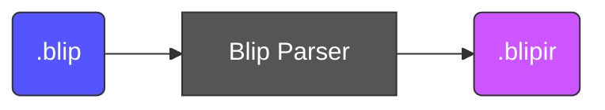
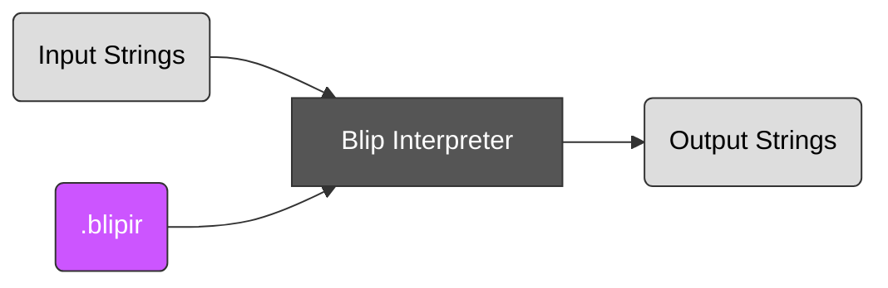
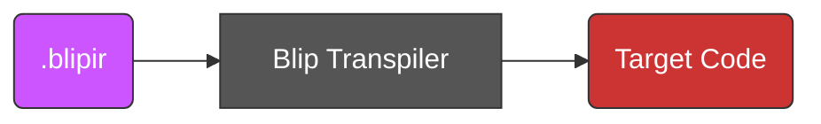

# Blip Ecosystem Design

Blip can be used in a few different ways:

1. Directly execute Blip code using an interpreter
2. Transpile Blip code into a target language, like Python or C

The `blip` CLI tool provides both of these capabilities.

## Intermediate representation - BlipIR

Blip code is first parsed into an intermediate representation (IR) that is more convenient for computers to handle.
This is dubbed BlipIR and takes the file extension `.blipir`.

Using the Blip parser, Blip code (`.blip`) can be parsed into BlipIR (`.blipir`):

You can run `blip` in IR Mode with the `--ir` flag to see the BlipIR of a Blip program.
BlipIR code is an Abstract Syntax Tree (AST) encoded in JSON.

BlipIR and the Blip parser are used for both transpiling and direct interpretation.
Therefore they are a very important part of the Blip processing lifecycle.

## Directly execute a Blip program using an interpreter

Using an interpreter, you can run a Blip program directly:

You can run `blip` in Interpret Mode with the `-i` / `--interpret` flag to run a Blip program directly.
The CLI output will be the result of the Blip program's execution.

To run a Blip program, the interpreter needs to be given any string inputs that the program has to process.

## Transpile a Blip program to a target language

Using a transpiler, you can convert a Blip program into a target language.
For example, you can transpile into Python code, or C code, or any language the transpiler supports.

You can run `blip` in Transpile Mode with the `-t` / `--transpile` flag to convert Blip to a target language.
For example, `--transpile python` will convert a Blip program to native Python code.

Transpile Mode will produce a function/submodule in the target language which accepts native string types and
outputs native string types. This is intended to be easy to copy-paste into an existing codebase in the target language.

If desired, Transpile Mode can also add a minimal wrapper around the function/submodule that is produced, to turn it into a full program in
the target language. This means adding code to parse program arguments for program's string inputs, and writing the resulting output strings
to the program's standard-out. When creating a full program, the output should be directly compilable/interpretable.
