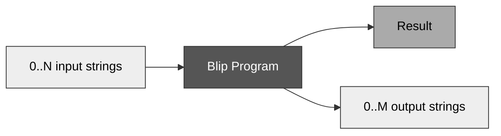

# Blip Program Design

Blip programs take zero or more strings as input and return zero or more strings as output.

Blip programs can fail, so they also output a result value to determine if the program completed successfully.

That's it. No other external factors, no special edge cases. Blip is designed like this intentionally to keep programs simple.

## Environmental influence and side-effects

Blip programs do not have side-effects.
They cannot print output to the console, make system calls, do networking, interact with peripheral devices, etc.
Similarly, Blip programs cannot be influenced by the environment they execute in.
They cannot access environment variables, read from files, receive data from a network, etc.
Blip programs also do not have support for random number generation.

This means Blip programs are fully isolated from the rest of the world.
The only way to influence a Blip program is via its input strings.
The only way a Blip program can influence the world is via its output strings.

This design choice makes Blip programs conceptually simple, and most importantly, **deterministic**.
Providing a known set of strings to a Blip program will always produce the same result.

## Fail-fast

Blip programs have implicit fail-fast semantics. If a program attempts an operation and it fails, the
program immediately halts and returns an error. This is to help enforce program invariants, and is useful for quickly
validating that strings match particular patterns, or meet certain criteria.

Programs that terminate with an error do not provide any normal string output;
they instead return an error result containing an error value describing the failure.

Standalone interpreters (like `blip -i`) should handle Blip program errors by exiting with a non-zero error code and printing the
error information to the standard error stream.

Transpiled Blip code should handle errors in a manner that is appropriate for the target language.
Exceptions should typically be used for languages that support them.
For languages that do not support exceptions, like C, a return code should be used to distinguish errors from success.

## 0 input strings?

A Blip program that does not use any input strings will always produce the same result.
This is because Blip programs are deterministic and cannot be influenced in any way other than their input strings.

Therefore, a 0-input Blip program is a fancy way of returning a hard-coded set of strings.

## 0 output strings?

A Blip program that does not output any strings can still useful, because Blip programs can fail and return a success/error result value.

If the input strings do not conform to an expected format, or some conditions do not hold, Blip can produce an error result.
Conversely, if no errors occur then Blip programs produce a success result.

Therefore, a 0-output Blip program is a useful way to validate a set of input strings.
